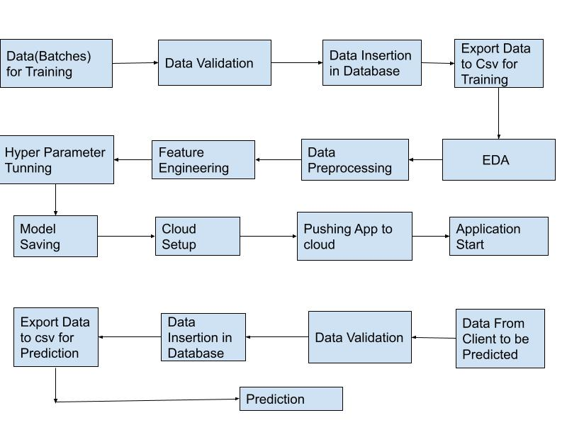
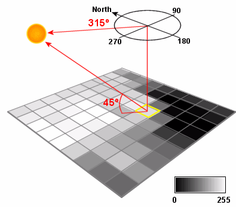
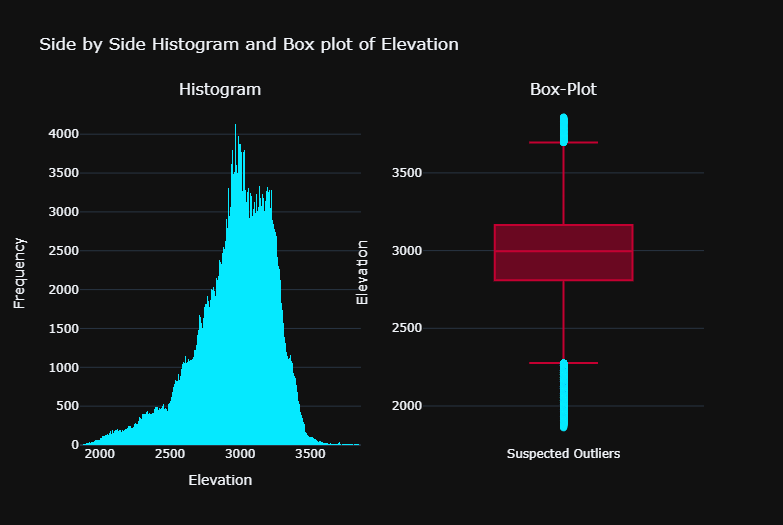
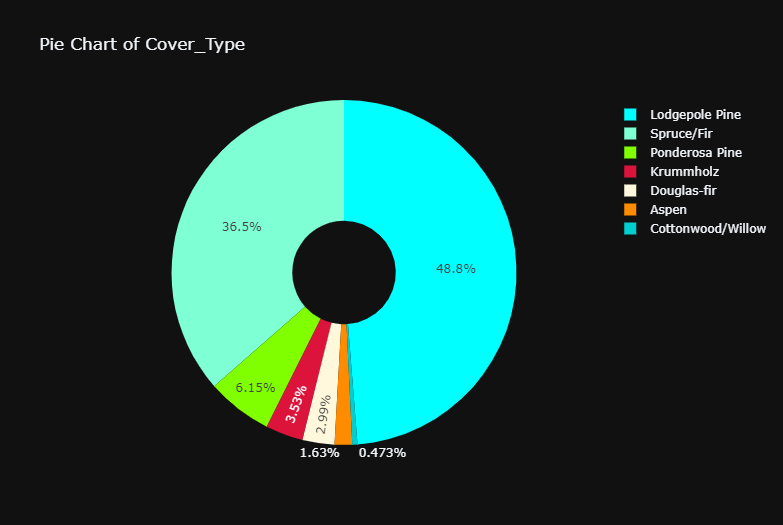
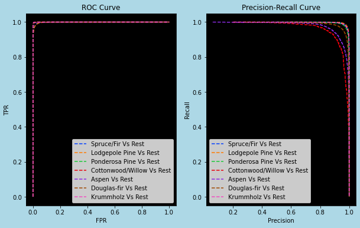

# ForestCoverTypePrediction
# Problem Statement
*To build a classification methodology to predict the type of forest cover based on the given training data.*

## Architecture

### Data Description
1. *Elevation* - Elevation in meters.

2. *Aspect* - The azimuth is the angular direction of the sun, measured from north in clockwise degrees from 0 to 360. An azimuth of 90 degrees is east.

3. *Slope* - Slope in degrees,

4. *Horizontal_Distance_To_Hydrology* - Horz Dist to nearest surface water features.

5. *Vertical_Distance_To_Hydrology* - Vert Dist to nearest surface water features.

6. *Horizontal_Distance_To_Roadways* - Horz Dist to nearest roadway.

*HillShade Index:-*
Hillshade is used to visualize the hypothetical illumination value (from 0-255) of each pixel on a surface given a specified light source. .Hillshading computes surface illumination as values from 0 to 255 based on a given compass direction to the sun (azimuth) and a certain altitude above the horizon (altitude)

7. *Hillshade_9am (0 to 255 index)* - Hillshade index at 9am, summer solstice.

8. *Hillshade_Noon (0 to 255 index)* - Hillshade index at noon, summer solstice.

9. *Hillshade_3pm (0 to 255 index)* - Hillshade index at 3pm, summer solstice.

10. *Horizontal_Distance_To_Fire_Points* - Horz Dist to nearest wildfire ignition points.

11. *Wilderness_Area (4 binary columns, 0 = absence or 1 = presence)* - Wilderness area designation.

12. *Soil_Type (40 binary columns, 0 = absence or 1 = presence)* - Soil Type designation.

13. *Cover_Type (7 types, integers 1 to 7)* - Forest Cover Type designation.

### Data Validation 
In this step, we perform different sets of validation on the given set of training files.

1.	 Name Validation- We validate the name of the files based on the given name in the schema file. We have created a regex pattern as per the name given in the schema file to use for validation. After validating the pattern in the name, we check for the length of date in the file name as well as the length of time in the file name. If all the values are as per requirement, we move such files to "Good_Data_Folder" else we move such files to "Bad_Data_Folder."

2.	 Number of Columns - We validate the number of columns present in the files, and if it doesn't match with the value given in the schema file, then the file is moved to "Bad_Data_Folder."
### Data Insertion in Database
 
1) Database Creation and connection - Create a database with the given name passed. If the database is already created, open the connection to the database. 

2) Table creation in the database - Table with name - "Good_Data", is created in the database for inserting the files in the "Good_Data_Folder" based on given column names and datatype in the schema file. If the table is already present, then the new table is not created and new files are inserted in the already present table as we want training to be done on new as well as old training files. 

3) Insertion of files in the table - All the files in the "Good_Data_Folder" are inserted in the above-created table. If any file has invalid data type in any of the columns, the file is not loaded in the table and is moved to "Bad_Data_Folder".

### EDA
Here are some of the plots from EDA

#### Important Observations from EDA:-
1. *Some Columns have right skew and left skew indicating outliers but further exploration showed that these outliers helped to develop a more robust model.*

2. *Vertical Distance to Hydrology has some Negative Values*

3. *Some Soil Type Columns had less then unique counts for a label. So I will remove such columns.*

4. *Pie Chart shows that there is class imbalance but there are 2000 examples of most minority class which should be enough to train a good classifier. Also Resampling is expensive operation here since training data is large.We should be able to get good results without handling class imbalance since there is sufficent training data.*

## Performance Metric
*Since there is class imbalance Micro-F1-Score is used.*

## Model Training
Here are the results of all the model trained.
+----------------------+----------+
|        Model         | F1 Score |
+----------------------+----------+
|     DecisionTree     |    94    |
|    Random Forest     |   96.8   |
| Extra Tree Classifier|   97.5   |
|       Xgboost        |   97.5   |
|       LightGBM       |   97.0   |
+----------------------+----------+
Since ExtraTreeClassifier and Xgboost performed best I selected both of these models and made a ensemble.

Stratified-KFold Cross Validation Strategy was used to train  the model.

## Model Evaluation

Here is the side by side ROC AUC and Precision Recall Curve of the ensemble model.

